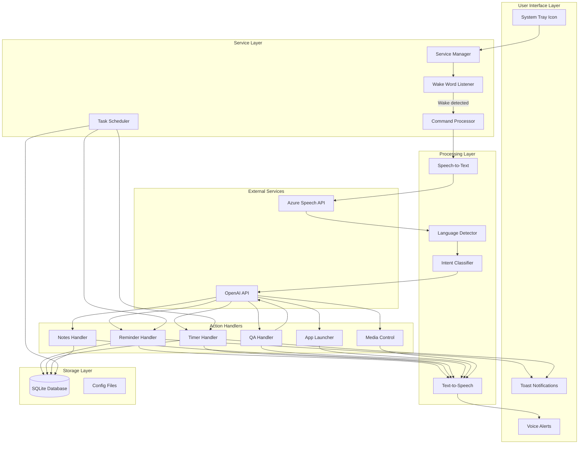
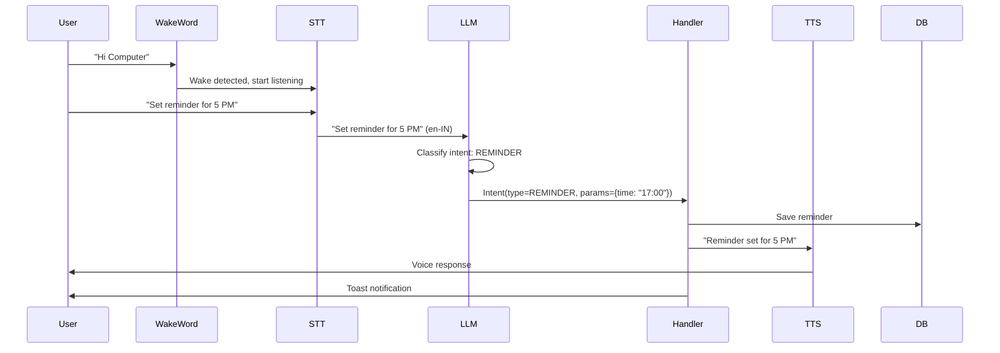
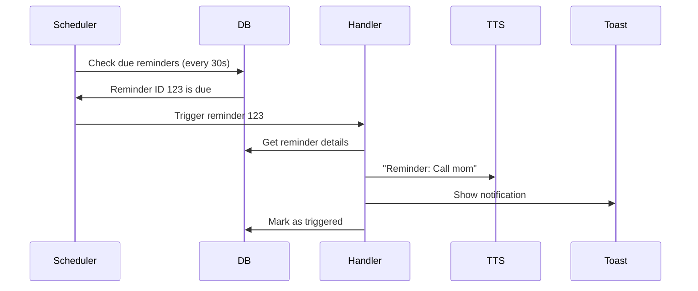

 # Computer Voice Assistant - System Architecture

## Overview

Computer is an event-driven, modular voice assistant that runs as a Windows background service. The architecture follows a pipeline pattern: Wake Word → STT → Intent Classification → Action Execution → Response.

## High-Level Architecture



## Component Specifications

### 1. Service Manager (`service/manager.py`)

**Responsibility:** Orchestrates all components and manages application lifecycle

**Key Functions:**
- Initialize all subsystems on startup
- Manage component lifecycle (start/stop/restart)
- Handle graceful shutdown
- Monitor component health
- Coordinate between wake word listener and command processor

**State Machine:**
```
IDLE → LISTENING (wake word detected) → PROCESSING (STT active) → 
EXECUTING (action handler) → RESPONDING (TTS) → IDLE
```

**Interfaces:**
```python
class ServiceManager:
    def start() -> None
    def stop() -> None
    def restart() -> None
    def get_status() -> ServiceStatus
    def on_wake_word_detected() -> None
    def on_command_received(audio: bytes) -> None
```

---

### 2. Wake Word Listener (`core/wake_word.py`)

**Responsibility:** Continuously listen for wake word "Computer"

**Technology:** Porcupine by Picovoice

**Key Functions:**
- Initialize Porcupine with custom wake word
- Run audio capture loop in background thread
- Emit event when wake word detected
- Handle microphone access and errors

**Configuration:**
- Wake phrases: "Hi Computer", "Sun Computer"
- Sensitivity: 0.5 (configurable)
- Audio format: 16kHz, 16-bit, mono

**Interfaces:**
```python
class WakeWordListener:
    def __init__(access_key: str, keyword_path: str)
    def start() -> None
    def stop() -> None
    def set_callback(callback: Callable) -> None
    def set_sensitivity(sensitivity: float) -> None
```

---

### 3. Speech-to-Text (`core/stt.py`)

**Responsibility:** Convert voice commands to text

**Technology:** Azure Speech API

**Key Functions:**
- Capture audio after wake word detection (3-5 seconds)
- Send to Azure Speech API
- Support bilingual recognition (en-IN, hi-IN)
- Handle network errors and retries

**Configuration:**
- Languages: en-IN (primary), hi-IN (secondary)
- Auto language detection: Enabled
- Profanity filter: Disabled
- Timeout: 5 seconds

**Interfaces:**
```python
class SpeechToText:
    def __init__(subscription_key: str, region: str)
    def recognize(audio: bytes) -> RecognitionResult
    def recognize_continuous() -> AsyncIterator[str]
    def set_languages(languages: List[str]) -> None
```

**Data Model:**
```python
@dataclass
class RecognitionResult:
    text: str
    language: str  # 'en-IN' or 'hi-IN'
    confidence: float
    duration_ms: int
```

---

### 4. Language Detector (`core/llm.py`)

**Responsibility:** Detect language and extract intent from transcribed text

**Technology:** OpenAI API (GPT-3.5-turbo or GPT-4)

**Key Functions:**
- Detect language (English/Hindi/Hinglish)
- Classify intent (reminder, timer, note, question, app_launch, media_control)
- Extract parameters (time, app name, action type)

**Prompt Template:**
```
You are a voice assistant intent classifier. Analyze the following command and return JSON:

Command: "{user_command}"

Return format:
{
  "intent": "reminder|timer|note|question|app_launch|media_control|unknown",
  "language": "en|hi|hinglish",
  "parameters": {
    // Intent-specific parameters
  },
  "response_language": "en|hi"
}
```

**Interfaces:**
```python
class IntentClassifier:
    def __init__(api_key: str, model: str)
    def classify(text: str) -> Intent
    def extract_parameters(text: str, intent_type: str) -> dict
```

**Data Model:**
```python
@dataclass
class Intent:
    type: IntentType  # Enum
    language: str
    parameters: dict
    response_language: str
    confidence: float
```

---

### 5. Action Handlers

#### 5.1 Reminder Handler (`handlers/reminder.py`)

**Responsibility:** Create, store, and trigger reminders

**Key Functions:**
- Parse reminder time (natural language → datetime)
- Store reminder in database
- Schedule reminder check
- Trigger notification at scheduled time

**Examples:**
- "Remind me to call mom at 5 PM"
- "Kal subah 8 baje meeting ka reminder"
- "Set reminder for tomorrow 3 PM"

**Interfaces:**
```python
class ReminderHandler:
    def create_reminder(text: str, time: datetime) -> Reminder
    def get_active_reminders() -> List[Reminder]
    def trigger_reminder(reminder_id: int) -> None
    def delete_reminder(reminder_id: int) -> None
```

---

#### 5.2 Timer Handler (`handlers/timer.py`)

**Responsibility:** Create and manage countdown timers

**Key Functions:**
- Parse timer duration
- Start countdown in background thread
- Trigger notification on completion

**Examples:**
- "Set timer for 5 minutes"
- "10 minute ka timer lagao"
- "Start 30 second timer"

**Interfaces:**
```python
class TimerHandler:
    def start_timer(duration_seconds: int, label: str) -> Timer
    def get_active_timers() -> List[Timer]
    def cancel_timer(timer_id: int) -> None
```

---

#### 5.3 Notes Handler (`handlers/notes.py`)

**Responsibility:** Store and retrieve simple key-value notes

**Key Functions:**
- Store facts/notes
- Retrieve notes by keyword
- Update existing notes

**Examples:**
- "Remember my favorite color is blue"
- "Mera birthday 15 January hai"
- "What's my favorite color?"

**Interfaces:**
```python
class NotesHandler:
    def save_note(key: str, value: str) -> Note
    def get_note(key: str) -> Optional[Note]
    def search_notes(query: str) -> List[Note]
    def delete_note(key: str) -> None
```

---

#### 5.4 QA Handler (`handlers/qa.py`)

**Responsibility:** Answer general knowledge questions

**Technology:** OpenAI API

**Key Functions:**
- Send question to LLM
- Get response in appropriate language
- Handle context from previous conversation

**Examples:**
- "What's the capital of France?"
- "Bharat ki population kitni hai?"
- "How to make tea?"

**Interfaces:**
```python
class QAHandler:
    def answer_question(question: str, language: str) -> str
    def set_context(context: List[Message]) -> None
```

---

#### 5.5 App Launcher (`handlers/app_launcher.py`)

**Responsibility:** Launch Windows applications

**Key Functions:**
- Map app names to executable paths
- Launch applications using subprocess
- Handle app not found errors

**Supported Apps (Default):**
- Chrome, Firefox, Edge
- Gmail (web), Outlook
- Calculator, Notepad
- File Explorer
- VS Code, PyCharm

**Configuration:** User can add custom apps via database

**Interfaces:**
```python
class AppLauncher:
    def launch_app(app_name: str) -> bool
    def register_app(name: str, path: str) -> None
    def get_registered_apps() -> List[App]
```

---

#### 5.6 Media Control (`handlers/media_control.py`)

**Responsibility:** Control Spotify/media playback

**Technology:** pyautogui (keyboard shortcuts)

**Key Functions:**
- Play/Pause (Space key)
- Next track (Ctrl+Right)
- Previous track (Ctrl+Left)
- Volume control (if requested)

**Examples:**
- "Play music"
- "Pause karo"
- "Next song"
- "Previous track"

**Interfaces:**
```python
class MediaControl:
    def play_pause() -> None
    def next_track() -> None
    def previous_track() -> None
    def volume_up() -> None
    def volume_down() -> None
```

---

### 6. Text-to-Speech (`core/tts.py`)

**Responsibility:** Convert text responses to voice

**Technology:** pyttsx3 (Windows SAPI)

**Key Functions:**
- Detect response language
- Select appropriate voice
- Speak response asynchronously

**Configuration:**
- Rate: 150 words/min
- Volume: 0.9
- Voice: Auto-select based on language

**Interfaces:**
```python
class TextToSpeech:
    def __init__()
    def speak(text: str, language: str) -> None
    def speak_async(text: str, language: str) -> None
    def stop() -> None
    def set_rate(rate: int) -> None
    def set_volume(volume: float) -> None
```

---

### 7. Task Scheduler (`service/scheduler.py`)

**Responsibility:** Background task execution (reminders, timer checks)

**Technology:** APScheduler

**Key Functions:**
- Check for due reminders every 30 seconds
- Monitor active timers
- Trigger notifications

**Interfaces:**
```python
class TaskScheduler:
    def start() -> None
    def stop() -> None
    def add_job(func: Callable, trigger: str, **kwargs) -> None
    def remove_job(job_id: str) -> None
```

---

### 8. System Tray (`service/tray.py`)

**Responsibility:** Provide user interface for status and controls

**Technology:** pystray

**Features:**
- Icon with status indicator (listening/processing/idle)
- Right-click menu:
  - Mic On/Off toggle
  - View active reminders
  - Settings
  - Exit

**Interfaces:**
```python
class SystemTray:
    def __init__(service_manager: ServiceManager)
    def show() -> None
    def hide() -> None
    def update_status(status: str) -> None
    def show_notification(title: str, message: str) -> None
```

---

## Data Flow Diagrams

### Command Processing Flow



### Reminder Trigger Flow



---

## Error Handling Strategy

### Network Errors (Azure/OpenAI API)
- **Retry:** 3 attempts with exponential backoff
- **Fallback:** Inform user "I'm having trouble connecting, please try again"
- **Logging:** Log all API failures

### Wake Word False Positives
- **Timeout:** If no command within 5 seconds, return to idle
- **Confirmation:** Play subtle beep on wake detection

### Microphone Access Errors
- **Detection:** Check on startup
- **User Notification:** System tray notification + voice alert
- **Recovery:** Retry every 30 seconds

### Database Errors
- **Backup:** Auto-backup before writes
- **Recovery:** Restore from backup on corruption
- **Logging:** Log all database operations

---

## Performance Considerations

### Wake Word Detection
- **Target:** < 500ms latency
- **Optimization:** Run in dedicated thread with high priority

### Command Response Time
- **Target:** < 3 seconds (end-to-end)
- **Breakdown:**
  - STT: ~1-1.5s
  - LLM: ~0.5-1s
  - Handler: ~0.1-0.5s
  - TTS: ~0.5-1s

### Resource Usage
- **Idle CPU:** < 2%
- **Active CPU:** < 15%
- **RAM:** < 150MB
- **Disk I/O:** Minimal (SQLite writes only on actions)

---

## Security Considerations

### API Keys
- Store in encrypted config file
- Never log API keys
- Use environment variables for development

### Audio Privacy
- No audio recording without wake word
- Audio sent to cloud only during active command
- No persistent audio storage

### Database
- Local SQLite (no cloud sync)
- Encrypted sensitive fields (future enhancement)

---

## Deployment Architecture

```
Windows Startup
    ↓
Service Manager (pythonw.exe - no console)
    ↓
Initialize Components
    ├── Wake Word Listener (background thread)
    ├── Task Scheduler (background thread)
    └── System Tray (UI thread)
    ↓
IDLE State (listening for wake word)
```

**Auto-start Method:** Windows Registry entry
```
HKEY_CURRENT_USER\Software\Microsoft\Windows\CurrentVersion\Run
Name: Computer
Value: "C:\Program Files\Computer\computer.exe"
```
